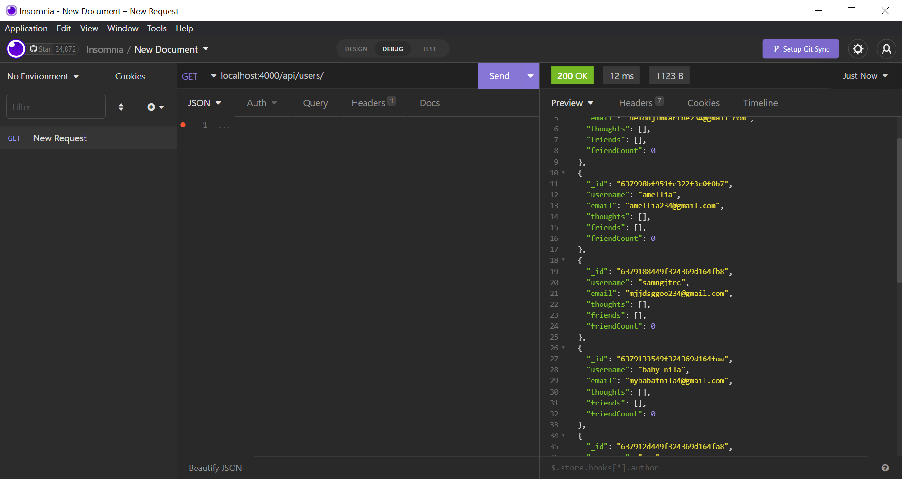
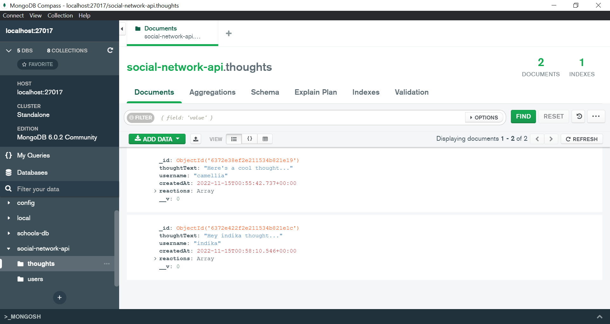
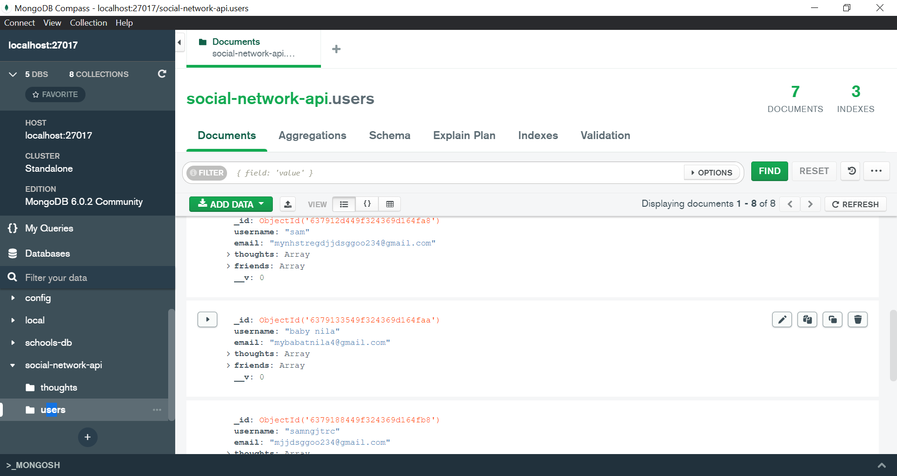

# description

thi is a Social-Network-Api application Build an API for a social network web application where users can share thoughts, react to friends thoughts, & create a friends list.

# UseAS A social media startup

I WANT an API for my social network that uses a NoSQL database
SO THAT my website can handle large amounts of unstructured datar Story

# use pakages

- Express.js
- Mongoose

# Acceptance Criteria

GIVEN a social network API
WHEN I enter the command to invoke the application
THEN my server is started and the Mongoose models are synced to the MongoDB database
WHEN I open API GET routes in Insomnia for users and thoughts
THEN the data for each of these routes is displayed in a formatted JSON
WHEN I test API POST, PUT, and DELETE routes in Insomnia
THEN I am able to successfully create, update, and delete users and thoughts in my database
WHEN I test API POST and DELETE routes in Insomnia
THEN I am able to successfully create and delete reactions to thoughts and add and remove friends to a user’s friend list

# Walkthrough Video link

https://drive.google.com/file/d/1q1aRqHZS5R-IcT0dR1oZv1HwOCK1EA63/view

# GitHub repository link

https://github.com/kusalaindika1/my-social-network-nosql-api

# Screen image

